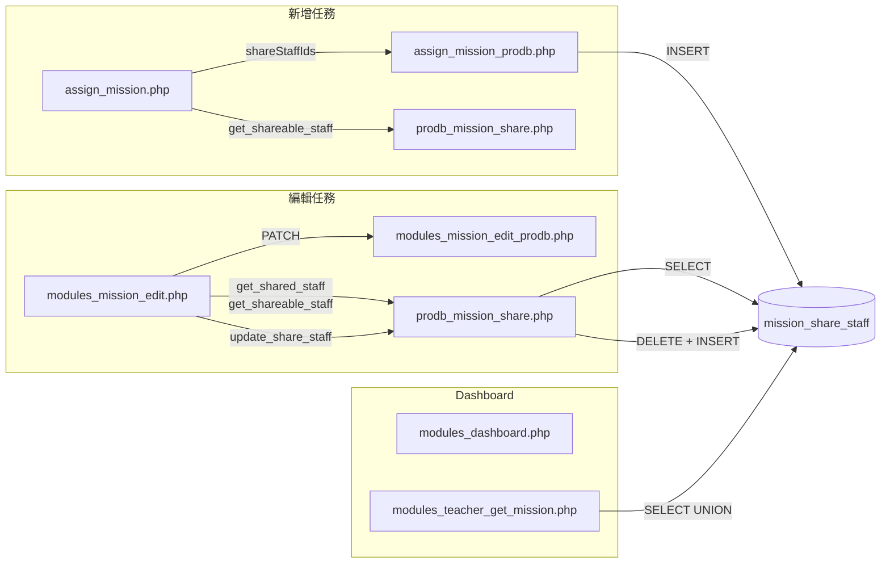
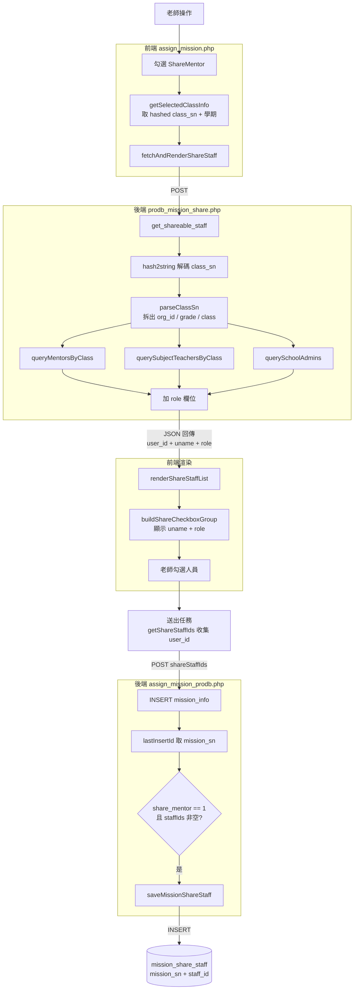
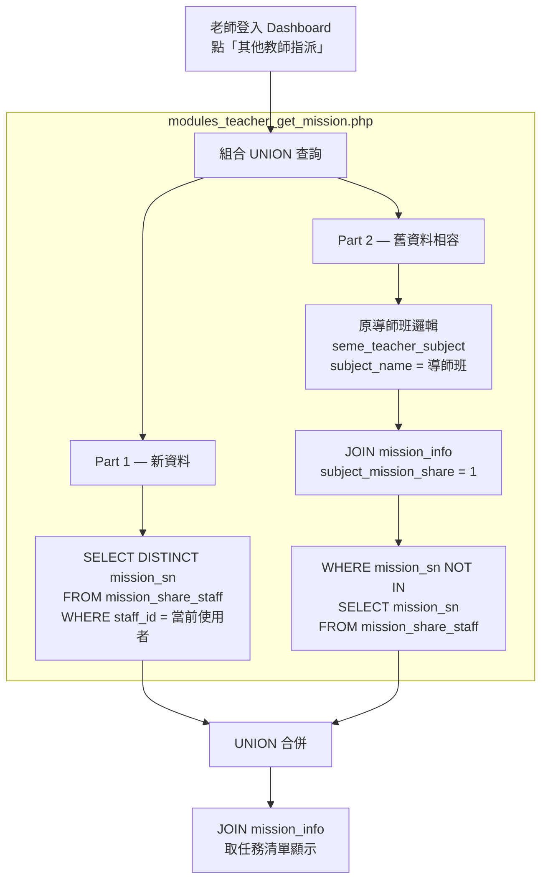
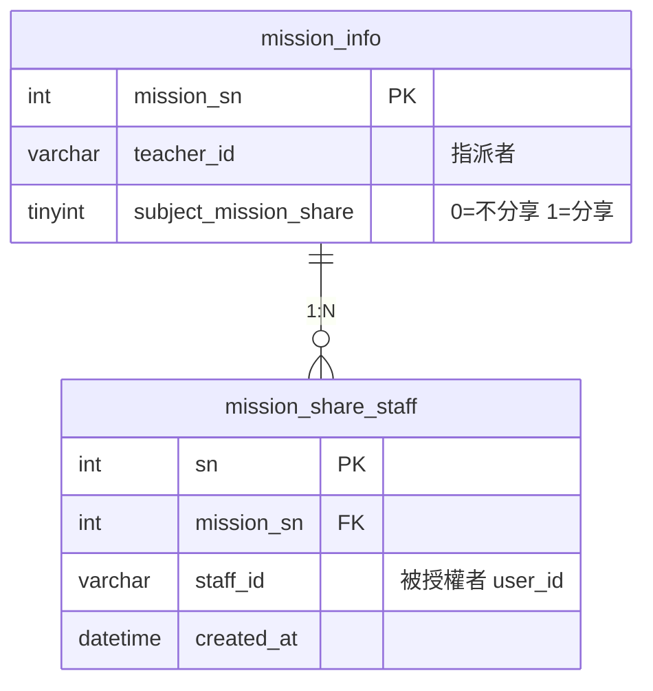

# quest1 — 任務觀看權限 數據流

## 全局總覽



---

## 新增任務：完整數據流



---

## 編輯任務：完整數據流

```mermaid
flowchart TD
    U[老師進入編輯頁面] --> E1

    subgraph 前端 modules_mission_edit.php
        E1[makeMissionData 載入任務資料]
        E1 --> E2{subject_mission_share == 1?}
        E2 -->|否| E2a[不載入分享清單]
        E2 -->|是| E3[loadShareStaffForEdit]
    end

    E3 -->|POST mission_sn| E4

    subgraph 後端 prodb_mission_share.php — 查已授權
        E4[get_shared_staff]
        E4 --> E4a[SELECT staff_id<br>FROM mission_share_staff]
        E4 --> E4b[SELECT subject_mission_share<br>FROM mission_info]
        E4a --> E4c{關聯表有記錄?}
        E4b --> E4c
        E4c -->|flag=1 且無記錄| E4d[is_legacy = true]
        E4c -->|flag=1 且有記錄| E4e[is_legacy = false]
    end

    E4d -->|JSON| E5
    E4e -->|JSON| E5

    subgraph 前端判斷 + 查可授權人員
        E5{is_legacy?}
        E5 -->|true 舊資料| E5a[查 get_shareable_staff<br>自動勾選該班導師]
        E5 -->|false 新資料| E5b[查 get_shareable_staff<br>依 shared_staff_ids 打勾]
    end

    E5a --> E6[renderShareStaffList]
    E5b --> E6

    E6 --> E7[老師修改勾選 → 按儲存]
    E7 -->|POST PATCH| E8[modules_mission_edit_prodb.php<br>更新 mission_info]
    E8 -->|成功| E9

    E9 -->|POST| E10

    subgraph 後端 prodb_mission_share.php — 更新
        E10[update_share_staff]
        E10 --> E10a[BEGIN TRANSACTION]
        E10a --> E10b[DELETE FROM mission_share_staff<br>WHERE mission_sn = ?]
        E10b --> E10c{ShareMentor == 1<br>且 staffIds 非空?}
        E10c -->|是| E10d[insertShareStaff<br>INSERT mission_share_staff]
        E10c -->|否| E10e[不寫入]
        E10d --> E10f[UPDATE mission_info<br>SET subject_mission_share = flag]
        E10e --> E10f
        E10f --> E10g[COMMIT]
    end

    E10g -->|成功| E11[前端顯示「儲存成功」]
```

---

## Dashboard 查詢：數據流



---

## 資料表欄位


