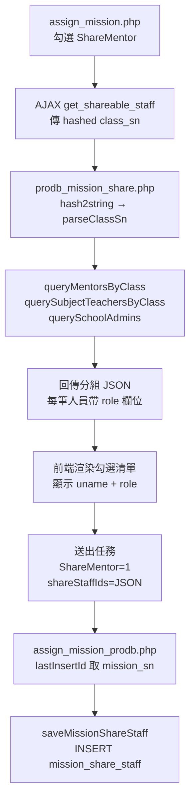
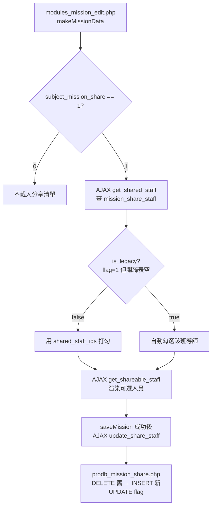
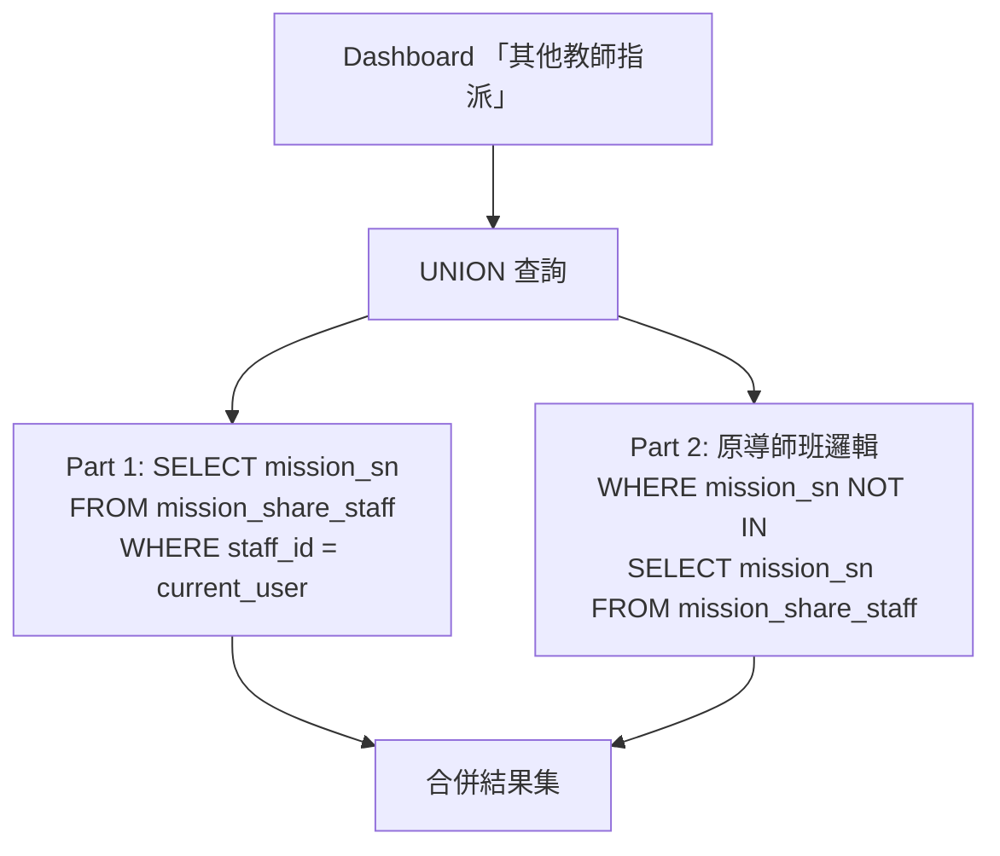

# quest1 — 任務觀看權限擴展 速查表

> 供 AI 協作時快速了解本次異動範圍與邏輯

---

## 需求摘要

科任老師指派任務時，原本只能開放給「該班導師」查看（單一 checkbox），現擴展為可指定分享給**同校的級任導師、科任教師、主任、校長**，被授權者可在 Dashboard 看到該任務。

---

## 異動檔案一覽

| 檔案 | 動作 | 改了什麼 |
|------|------|----------|
| `modules/assignMission/prodb_mission_share.php` | **新建** | 分享相關所有 AJAX action（獨立 router） |
| `modules/assignMission/assign_mission.php` | 改 | 前端 UI（MISSION_AUTHORITY 區塊）+ JS 事件 + AJAX 送出參數 |
| `modules/assignMission/assign_mission_prodb.php` | 改 | 接收 `shareStaffIds` 參數 + 4 處 `lastInsertId()` 後寫入關聯表 + 新增 `saveMissionShareStaff()` |
| `modules/dashboard/modules_teacher_get_mission.php` | 改 | 「科任指派」查詢改為 UNION（新資料查關聯表 + 舊資料相容） |
| `modules/dashboard/modules_dashboard.php` | 改 | 「科任指派」→「其他教師指派」文字替換 |
| `modules/dashboard/modules_mission_edit.php` | 改 | 編輯頁面接入分享功能：UI + 載入/儲存邏輯 |

---

## 新建資料表

```sql
CREATE TABLE mission_share_staff (
    sn            INT AUTO_INCREMENT PRIMARY KEY,
    mission_sn    INT NOT NULL,           -- FK → mission_info.mission_sn
    staff_id      VARCHAR(60) NOT NULL,   -- 被授權觀看的教職人員 user_id
    created_at    DATETIME DEFAULT CURRENT_TIMESTAMP,
    INDEX idx_mission_sn (mission_sn),
    INDEX idx_staff_id (staff_id),
    UNIQUE KEY uk_mission_staff (mission_sn, staff_id)
) ENGINE=InnoDB DEFAULT CHARSET=utf8mb4;
```

---

## 核心邏輯

### 資料流程圖

#### 指派任務（assign_mission）



#### 編輯任務（modules_mission_edit）



#### Dashboard 查詢（modules_teacher_get_mission）



### 旗標 + 關聯表的向下相容機制

| `subject_mission_share` | `mission_share_staff` 有記錄 | 行為 |
|---|---|---|
| 0 | — | 不分享 |
| 1 | 有記錄 | **新邏輯**：依關聯表決定誰可查 |
| 1 | 無記錄 | **舊資料**：退回原邏輯，僅該班導師可查 |

### 可授權對象查詢邏輯

| 角色 | 查詢方式 | 回傳 role 值 | 資料來源 |
|------|----------|-------------|----------|
| 級任導師 | `user_info.grade/class` 匹配目標班級 + `access_level IN (21,25)` | `級任導師` | `user_info` + `user_status` |
| 科任教師 | 教該班的老師 | `科任教師（科目名）` | `seme_teacher_subject` + `seme_teacher_subject_mapping` |
| 主任 | `access_level = 31` + 同校 | `主任` | `user_info` + `user_status` |
| 校長 | `access_level = 32` + 同校 | `校長` | `user_info` + `user_status` |

- 全部排除指派者自己
- 不跨校
- 後端每筆人員帶 `role` 欄位，前端統一用 `t.uname + ' (' + t.role + ')'` 顯示

---

## prodb_mission_share.php 結構

```
switch ($action)
├── get_shareable_staff   → getShareableStaff($dbh_slave)   // 查可授權人員（含 role）
├── get_shared_staff      → getSharedStaff($dbh_slave)      // 查已授權人員（編輯載入），回傳 is_legacy 旗標
└── update_share_staff    → updateShareStaff($dbh)           // 更新授權（事後編輯）

共用 functions:
├── queryMentorsByClass()          // 查該班導師
├── querySubjectTeachersByClass()  // 查該班科任
├── querySchoolAdmins()            // 查該校主任/校長
├── insertShareStaff()             // 批次寫入關聯表
├── parseClassSn()                 // 解析 class_sn（orgId-gradeClass → org_id, grade, class）
└── parseShareStaffIds()           // 解析前端 JSON 字串
```

Router: `encodeAjaxUrlBase64('assignMission', 'prodb_mission_share')`

---

## 前端資料流

```
選班級 → toggle「開放」→ AJAX get_shareable_staff（傳 hashed class_sn）
    → 回傳每筆人員含 user_id, uname, role
    → 渲染分組勾選清單（級任導師 / 科任教師 / 主任校長）
    → 送出時 ShareMentor=1, shareStaffIds=JSON.stringify([...])
```

前端 class_sn 來源：checkbox ID `{class_type}_{hashedClassSn}_{seme}`，取 `split("_")[2]`

---

## assign_mission_prodb.php 改動位置

- **Line ~2070**: 新增 `$shareStaffIds` 參數接收（在原 `$share_mentor` 之後）
- **4 處 lastInsertId() 後**: 各加 `saveMissionShareStaff()` 呼叫（條件: `$share_mentor == 1 && !empty($shareStaffIds)`）
- **新增 function**: `saveMissionShareStaff($dbh, $missionSn, $staffIds)` 在 `addMissionRecord()` 旁邊

---

## Dashboard 查詢邏輯（modules_teacher_get_mission.php）

「其他教師指派」（原「科任指派」）的 JOIN 查詢改為 UNION 兩段：

1. **新資料**：`SELECT mission_sn FROM mission_share_staff WHERE staff_id IN (:user)`
2. **舊資料相容**：原有導師班邏輯 + `mission_sn NOT IN (SELECT mission_sn FROM mission_share_staff)`

---

## 舊資料編輯處理（方案 A）

`get_shared_staff` 回傳 `is_legacy` 旗標，前端判斷邏輯：

```
呼叫 get_shared_staff(mission_sn)
├── is_legacy = false → 新資料，依 shared_staff_ids 打勾
└── is_legacy = true  → 舊資料（share_flag=1 但關聯表空）
    → 查可授權人員後，自動幫該班導師打勾（預設勾選）
    → 使用者可修改
    → 儲存後寫入關聯表，從此變成新資料
```

---

## 編輯頁面（modules_mission_edit.php）

### 新增內容
- `shareRouter` 變數（指向 `prodb_mission_share`）
- ShareMentor 區塊改為含分組人員勾選清單
- `loadShareStaffForEdit()`: 載入時先查 `get_shared_staff`（含 `is_legacy` 判斷），再查 `get_shareable_staff` 渲染清單
- `saveMission()`: 主任務儲存成功後，呼叫 `update_share_staff` 更新關聯表

### 資料流
```
makeMissionData() → subject_mission_share==1 → loadShareStaffForEdit()
  → get_shared_staff（查已授權 + is_legacy）
  → get_shareable_staff（查可授權人員，每筆帶 role）
  → renderShareStaffList（舊資料自動勾導師，新資料依關聯表勾選）

saveMission() → 主 AJAX 成功 → update_share_staff → 顯示儲存成功
```

---

## 命名對照（rename 記錄）

| 舊命名 | 新命名 | 原因 |
|--------|--------|------|
| `mission_share_teacher` | `mission_share_staff` | 包含主任/校長，非僅教師 |
| `teacher_id`（關聯表欄位） | `staff_id` | 同上 |
| `shared_teacher_ids` | `shared_staff_ids` | 同上 |
| `shareTeacherIds` | `shareStaffIds` | 同上 |
| `share-teacher-cb` | `share-staff-cb` | 同上 |
| 前端 `labelFn` 各自寫死 | 後端統一帶 `role` 欄位 | 擴展性：新增角色不需改前端 |

---

## 未改動 / 待辦

- 共享任務流程（assignshare）**未改動**
- Dashboard 呈現方式**未異動**（不加「由 XX 分享」標示）
- 批次指派**不支援**
